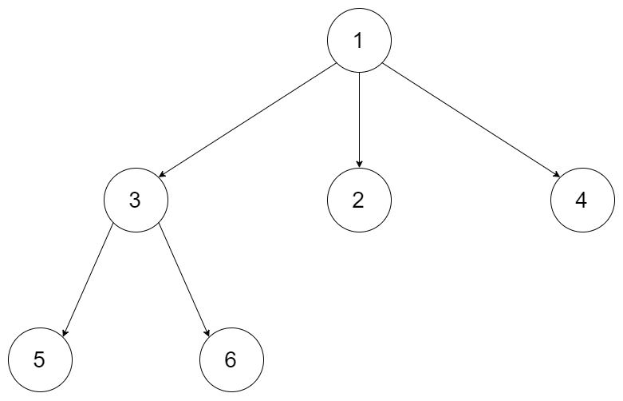

# Array permutation (time complexity: O(n * n!)

[leetcode 46](https://leetcode.cn/problems/permutations/)

## [AcWing 842](https://www.acwing.com/problem/content/description/844/) (生成数组 [1, 2, .. n] 的全排序）

给定一个整数 $n$，将数字 1 ~ $n$ 排成一排，将会有很多种排列方法。

现在，请你按照字典序将所有的排列方法输出。

### **输入格式**

共一行，包含一个整数 $n$。

### **输出格式**

按字典序输出所有排列方案，每个方案占一行。

### **数据范围**

1 ≤ n ≤ 7

### **输入样例：**

```
3
```

### **输出样例：**

```
1 2 3
1 3 2
2 1 3
2 3 1
3 1 2
3 2 1
```

```cpp
#include <bits/stdc++.h>

using namespace std;

const int N = 10;

int n;
int path[N];
bool used[N];

void show() {
    for (int i = 1; i <= n; i++) {
        printf("%d ", path[i]);
    }
    puts("");
}

void dfs(int index) {
    if (index == n + 1) {
        show();
        return;
    }
    for (int i = 1; i <= n; i++) {
        if (!used[i]) {
            path[index] = i;
            used[i] = true;
            dfs(index + 1);
            used[i] = false;
        }
    }
}

int main() {
    scanf("%d", &n);
    dfs(1);
    return 0;
}
```

## [LeetCode 47](https://leetcode.cn/problems/permutations-ii/) (生成数组arr的全部排列，每个排列不能重复，arr中可能含有重复元素）

Given a collection of numbers, `nums`, that might contain duplicates, return *all possible unique permutations **in any order**.*

**Example 1:**

```
**Input**: nums = [1,1,2]
**Output**:
[[1,1,2],
 [1,2,1],
 [2,1,1]]
```

**Example 2:**

```
**Input**: nums = [1,2,3]
**Output**: [[1,2,3],[1,3,2],[2,1,3],[2,3,1],[3,1,2],[3,2,1]]
```

**Constraints:**

- `1 <= nums.length <= 8`
- `10 <= nums[i] <= 10`

```cpp
#include <bits/stdc++.h>

using namespace std;

class Solution {
    int n;
    vector<bool> st;
    vector<int> path;
    vector<vector<int>> res;

    void dfs(vector<int> &nums, int u) {
        if (u == n) {
            res.push_back(path);
            return;
        }
        for (int i = 0; i < nums.size(); i++) {
            if (st[i] || i > 0 && nums[i] == nums[i - 1] && !st[i - 1]) continue;
            path[u] = nums[i];
            st[i] = true;
            dfs(nums, u + 1);
            st[i] = false;
        }
    }

public:
    vector<vector<int>> permuteUnique(vector<int> &nums) {
        n = (int) nums.size();
        st.resize(n);
        path.resize(n);
        sort(nums.begin(), nums.end());
        dfs(nums, 0);
        return res;
    }
};
```

## [LeetCode **491. Non-decreasing Subsequences](https://leetcode.cn/problems/non-decreasing-subsequences/description/) (**生成数组arr的全部非下降子序列，每个序列不能重复，arr中可能含有重复元素）

Given an integer array `nums`, return *all the different possible non-decreasing subsequences of the given array with at least two elements*. You may return the answer in **any order**.

**Example 1:**

```
**Input**: nums = [4,6,7,7]
**Output**: [[4,6],[4,6,7],[4,6,7,7],[4,7],[4,7,7],[6,7],[6,7,7],[7,7]]
```

**Example 2:**

```
**Input**: nums = [4,4,3,2,1]
**Output**: [[4,4]]
```

**Constraints:**

- `1 <= nums.length <= 15`
- `100 <= nums[i] <= 100`

### C++

```cpp
#include <bits/stdc++.h>

using namespace std;

class Solution {
    vector<int> path;
    vector<vector<int>> paths;
    vector<int> arr;

    void dfs(int cur, int prev) {
        if (cur == arr.size()) {
            if (path.size() >= 2) {
                paths.push_back(path);
            }
            return;
        }
        if (arr[cur] >= prev) {
            path.push_back(arr[cur]);
            dfs(cur + 1, arr[cur]);
            path.pop_back();
        }
        if (arr[cur] != prev) {
            dfs(cur + 1, prev);
        }
    }

public:
    vector<vector<int>> findSubsequences(vector<int> &nums) {
        arr = nums;
        dfs(0, INT32_MIN);
        return paths;
    }
};
```

### Python3

```cpp
from typing import List

class Solution:
    def findSubsequences(self, nums: List[int]) -> List[List[int]]:
        path, res = [], []

        def dfs(u: int) -> None:
            if u == len(nums):
                if len(path) >= 2:
                    res.append(path[:])
                return
            if not path or path[-1] < nums[u]:
                dfs(u + 1)

                path.append(nums[u])
                dfs(u + 1)
                path.pop()
            elif path[-1] == nums[u]:
                path.append(nums[u])
                dfs(u + 1)
                path.pop()
            else:
                dfs(u + 1)

        dfs(0)
        return res
```

# [AcWing 843. N-Queen problem](https://www.acwing.com/problem/content/description/845/)

$**n$-皇后** 问题是指将 $n$ 个皇后放在 $n$*$n$ 的国际象棋棋盘上，使得皇后不能相互攻击到，即任意两个皇后都不能处于同一行、同一列或同一斜线上。

现在给定整数 $n$，请你输出所有的满足条件的棋子摆法。

### **输入格式**

共一行，包含整数 $n$。

### **输出格式**

每个解决方案占 $n$ 行，每行输出一个长度为 nn 的字符串，用来表示完整的棋盘状态。

其中 `.` 表示某一个位置的方格状态为空，`Q` 表示某一个位置的方格上摆着皇后。

每个方案输出完成后，输出一个空行。

**注意：行末不能有多余空格。**

输出方案的顺序任意，只要不重复且没有遗漏即可。

### **数据范围**

1 ≤ n ≤ 9

### **输入样例：**

```
4
```

### **输出样例：**

```css
.Q..
...Q
Q...
..Q.

..Q.
Q...
...Q
.Q..
```

```cpp
#include <bits/stdc++.h>

using namespace std;

const int N = 20;

int n;
bool col[N], dg[N], udg[N];
char path[N][N];

void dfs(int u) {
    if (u == n) {
        for (int i = 0; i < n; i++) puts(path[i]);
        puts("");
        return;
    }

    for (int i = 0; i < n; i++) {
        if (!col[i] && !dg[u + i] && !udg[u + n - i]) {
            col[i] = dg[u + i] = udg[u + n - i] = true;
            path[u][i] = 'Q';
            dfs(u + 1);
            path[u][i] = '.';
            col[i] = dg[u + i] = udg[u + n - i] = false;
        }
    }
}

int main() {
    scanf("%d", &n);
    for (int i = 0; i < n; i++) {
        for (int j = 0; j < n; j++) {
            path[i][j] = '.';
        }
    }
    dfs(0);
    return 0;
}
```


# Serialize and Deserialize Trees
## [LeetCode **297. Serialize and Deserialize Binary Tree**](https://leetcode.cn/problems/serialize-and-deserialize-binary-tree/description/)

Serialization is the process of converting a data structure or object into a sequence of bits so that it can be stored in a file or memory buffer, or transmitted across a network connection link to be reconstructed later in the same or another computer environment.

Design an algorithm to serialize and deserialize a binary tree. There is no restriction on how your serialization/deserialization algorithm should work. You just need to ensure that a binary tree can be serialized to a string and this string can be deserialized to the original tree structure.

**Clarification:** The input/output format is the same as [how LeetCode serializes a binary tree](https://support.leetcode.com/hc/en-us/articles/360011883654-What-does-1-null-2-3-mean-in-binary-tree-representation-). You do not necessarily need to follow this format, so please be creative and come up with different approaches yourself.

**Example 1:**


```
Input: root = [1,2,3,null,null,4,5]
Output: [1,2,3,null,null,4,5]
```

**Example 2:**

```
Input: root = []
Output: []
```

**Constraints:**

- The number of nodes in the tree is in the range `[0, $10^4$]`.
- `1000 <= Node.val <= 1000`

```cpp
#include <bits/stdc++.h>

using namespace std;

struct TreeNode {
    int val;
    TreeNode *left;
    TreeNode *right;

    TreeNode(int x) : val(x), left(NULL), right(NULL) {}
};

class Codec {
public:
    string serialize(TreeNode *root) {
        string res;
        dfs_s(root, res);
        return res;
    }

    TreeNode *deserialize(string data) {
        int index = 0;
        return dfs_d(data, index);
    }

private:
    void dfs_s(TreeNode *root, string &res) {
        if (!root) {
            res += "null ";
            return;
        }
        res += to_string(root->val) + ' ';
        dfs_s(root->left, res);
        dfs_s(root->right, res);
    }

    TreeNode *dfs_d(string &data, int &index) {
        if (index == data.length()) return nullptr;
        int k = index;
        while (k < data.length() && data[k] != ' ') {
            k++;
        }
        if (data[index] == 'n') {
            index = k + 1;
            return nullptr;
        }
        int val = stoi(data.substr(index, k - index));
        index = k + 1;
        auto *root = new TreeNode(val);
        root->left = dfs_d(data, index);
        root->right = dfs_d(data, index);
        return root;
    }
};
```

## [LeetCode 428. Serialize and Deserialize N-ary Tree](https://leetcode.cn/problems/serialize-and-deserialize-n-ary-tree/)

Serialization is the process of converting a data structure or object into a sequence of bits so that it can be stored in a file or memory buffer, or transmitted across a network connection link to be reconstructed later in the same or another computer environment.

Design an algorithm to serialize and deserialize an N-ary tree. An N-ary tree is a rooted tree in which each node has no more than N children. There is no restriction on how your serialization/deserialization algorithm should work. You just need to ensure that an N-ary tree can be serialized to a string and this string can be deserialized to the original tree structure.

For example, you may serialize the following 3-ary tree



as [1 [3[5 6] 2 4]]. Note that this is just an example, you do not necessarily need to follow this format.

Or you can follow LeetCode's level order traversal serialization format, where each group of children is separated by the null value.


For example, the above tree may be serialized as [1,null,2,3,4,5,null,null,6,7,null,8,null,9,10,null,null,11,null,12,null,13,null,null,14].

You do not necessarily need to follow the above-suggested formats, there are many more different formats that work so please be creative and come up with different approaches yourself.

**Example 1:**

```cpp
Input: root = [1,null,2,3,4,5,null,null,6,7,null,8,null,9,10,null,null,11,null,12,null,13,null,null,14]
Output: [1,null,2,3,4,5,null,null,6,7,null,8,null,9,10,null,null,11,null,12,null,13,null,null,14]
```

**Example 2:**

```cpp
Input: root = [1,null,3,2,4,null,5,6]
Output: [1,null,3,2,4,null,5,6]
```

Example 3:

```cpp
Input: root = []
Output: []
```

**Constraints:**

- The number of nodes in the tree is in the range [0, 10000].
- 0 <= Node.val <= 10000
- The height of the n-ary tree is less than or equal to 1000
- Do not use class member/global/static variables to store states. Your encode and decode algorithms should be stateless.

```cpp
#include <bits/stdc++.h>

using namespace std;

class Node {
public:
    int val;
    vector<Node *> children;

    Node() {}

    Node(int _val) {
        val = _val;
    }

    Node(int _val, vector<Node *> _children) {
        val = _val;
        children = _children;
    }
};

class Codec {
    void dfs1(Node *root, string &s) {
        s += to_string(root->val);
        s.push_back('(');
        for (Node *child: root->children) {
            dfs1(child, s);
        }
        s.push_back(')');
    }

    Node *dfs2(string &s, int &u) {
        if (s[u] == ')') return nullptr;
        int x = 0;
        while (isdigit(s[u])) {
            x = x * 10 + s[u] - '0';
            u++;
        }
        u++;
        auto root = new Node(x);
        vector<Node *> children;
        while (true) {
            auto t = dfs2(s, u);
            if (t) children.push_back(t);
            else break;
            u++;
        }
        root->children = children;
        return root;
    }

public:
    string serialize(Node *root) {
        if (!root) return "";
        string s;
        dfs1(root, s);
        return s;
    }

    Node *deserialize(string data) {
        if (data.empty()) return nullptr;
        int u = 0;
        return dfs2(data, u);
    }
};
```


# Classic problems
## [LeetCode **106. Construct Binary Tree from Inorder and Postorder Traversal**](https://leetcode.cn/problems/construct-binary-tree-from-inorder-and-postorder-traversal/description/)

Given two integer arrays `inorder` and `postorder` where `inorder` is the inorder traversal of a binary tree and `postorder` is the postorder traversal of the same tree, construct and return *the binary tree*.

**Example 1:**


```
Input: inorder = [9,3,15,20,7], postorder = [9,15,7,20,3]
Output: [3,9,20,null,null,15,7]
```

**Example 2:**

```
Input: inorder = [-1], postorder = [-1]
Output: [-1]
```

**Constraints:**

- `1 <= inorder.length <= 3000`
- `postorder.length == inorder.length`
- `3000 <= inorder[i], postorder[i] <= 3000`
- `inorder` and `postorder` consist of **unique** values.
- Each value of `postorder` also appears in `inorder`.
- `inorder` is **guaranteed** to be the inorder traversal of the tree.
- `postorder` is **guaranteed** to be the postorder traversal of the tree.

```jsx
class Solution {
    unordered_map<int, int> pos;
    vector<int> post;
public:
    TreeNode *buildTree(vector<int> &inorder, vector<int> &postorder) {
        int n = (int) inorder.size();
        for (int i = 0; i < n; i++) pos[inorder[i]] = i;
        post = std::move(postorder);
        return construct(0, n - 1, 0, n - 1);
    }

    TreeNode *construct(int il, int ir, int pl, int pr) {
        if (pl > pr) return nullptr;
        auto root = new TreeNode(post[pr]);
        int idx = pos[post[pr]];
        root->left = construct(il, idx - 1, pl, pl + idx - il - 1);
        root->right = construct(idx + 1, ir, pl + idx - il, pr - 1);
        return root;
    }
};
```

## [LeetCode 440. K-th Smallest in Lexicographical Order](https://leetcode.cn/problems/k-th-smallest-in-lexicographical-order/)

Given two integers `n` and `k`, return *the* `kth` *lexicographically smallest integer in the range* `[1, n]`.

**Example 1:**

**Input:** n = 13, k = 2
**Output:** 10
**Explanation:** The lexicographical order is \[1, 10, 11, 12, 13, 2, 3, 4, 5, 6, 7, 8, 9\], so the second smallest number is 10.

**Example 2:**

**Input:** n = 1, k = 1
**Output:** 1

**Constraints:**

-   `1 <= k <= n <= 1e9`
```cpp
#include <bits/stdc++.h>

using namespace std;

class Solution {
    int get_steps(int cur, long long n) {
        int steps = 0;
        long long first = cur, last = cur;
        while (first <= n) {
            steps += (int) (min(last, n) - first + 1);
            first *= 10, last = last * 10 + 9;
        }
        return steps;
    }

public:
    int findKthNumber(int n, int k) {
        int cur = 1;
        k--;
        while (k) {
            int step = get_steps(cur, n);
            if (step <= k) cur++, k -= step;
            else cur *= 10, k--;
        }
        return cur;
    }
};
```
## [LeetCode 1372. Longest ZigZag Path in a Binary Tree](https://leetcode.cn/problems/longest-zigzag-path-in-a-binary-tree/)

You are given the `root` of a binary tree.

A ZigZag path for a binary tree is defined as follow:

-   Choose **any** node in the binary tree and a direction (right or left).
-   If the current direction is right, move to the right child of the current node; otherwise, move to the left child.
-   Change the direction from right to left or from left to right.
-   Repeat the second and third steps until you can't move in the tree.

Zigzag length is defined as the number of nodes visited - 1. (A single node has a length of 0).

Return *the longest **ZigZag** path contained in that tree*.

**Example 1:**


**Input:** root = \[1,null,1,1,1,null,null,1,1,null,1,null,null,null,1,null,1\]
**Output:** 3
**Explanation:** Longest ZigZag path in blue nodes (right -> left -> right).

**Example 2:**


**Input:** root = \[1,1,1,null,1,null,null,1,1,null,1\]
**Output:** 4
**Explanation:** Longest ZigZag path in blue nodes (left -> right -> left -> right).

**Example 3:**

**Input:** root = \[1\]
**Output:** 0

**Constraints:**

-   The number of nodes in the tree is in the range `[1, 5 * 104]`.
-   `1 <= Node.val <= 100`
```cpp
#include <unordered_map>  
  
using namespace std;  
  
struct TreeNode {  
    int val;  
    TreeNode *left;  
    TreeNode *right;  
  
    TreeNode() : val(0), left(nullptr), right(nullptr) {}  
  
    TreeNode(int x) : val(x), left(nullptr), right(nullptr) {}  
  
    TreeNode(int x, TreeNode *left, TreeNode *right) : val(x), left(left), right(right) {}  
};  
  
class Solution {  
public:  
    int longestZigZag(TreeNode *root) {  
        res = 0;  
        dfs(root);  
        return res;  
    }  
  
private:  
    using PII = pair<int, int>;  
    int res;  
  
    PII dfs(TreeNode *root) {  
        if (!root) return {-1, -1};  
        int l = dfs(root->left).second + 1;  
        int r = dfs(root->right).first + 1;  
        res = max(res, max(l, r));  
        return {l, r};  
    }  
};
```
## [LeetCode **2360. Longest Cycle in a Graph**](https://leetcode.cn/problems/longest-cycle-in-a-graph/description/)

You are given a **directed** graph of `n` nodes numbered from `0` to `n - 1`, where each node has **at most one** outgoing edge.

The graph is represented with a given **0-indexed** array `edges` of size `n`, indicating that there is a directed edge from node `i` to node `edges[i]`. If there is no outgoing edge from node `i`, then `edges[i] == -1`.

Return *the length of the **longest** cycle in the graph*. If no cycle exists, return `-1`.

A cycle is a path that starts and ends at the **same** node.

**Example 1:**


```
Input: edges = [3,3,4,2,3]
Output: 3
Explanation: The longest cycle in the graph is the cycle: 2 -> 4 -> 3 -> 2.
The length of this cycle is 3, so 3 is returned.
```

**Example 2:**


```
Input: edges = [2,-1,3,1]
Output: -1
Explanation: There are no cycles in this graph.
```

**Constraints:**

- `n == edges.length`
- `2 <= n <= $10^5$`
- `1 <= edges[i] < n`
- `edges[i] != i`

```cpp
#include <bits/stdc++.h>

using namespace std;

class Solution {
public:
    int longestCycle(vector<int> &edges) {
        int n = (int) edges.size();
        vector<int> time(n);
        int res = -1;
        for (int i = 0, clock = 1; i < edges.size(); i++) {
            if (time[i]) continue;
            for (int x = i, start = clock; ~x; x = edges[x]) {
                if (time[x]) {
                    if (time[x] >= start) {
                        res = max(res, clock - time[x]);
                    }
                    break;
                }
                time[x] = clock++;
            }
        }
        return res;
    }
};
```


## [# ARC111B Reversible Cards](https://atcoder.jp/contests/arc111/tasks/arc111_b)