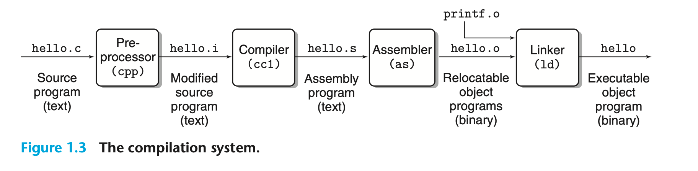

Here, the gcc compiler driver reads the source file hello.c and translates it into an executable object file hello. The translation is performed in the sequence of four phases. The programs that perform the four phases (preprocessor, compiler, assembler, and linker) are known collectively as the compilation system.

- Preprocessing phase. The preprocessor (`cpp`) modifies the original C program according to directives that begin with the `‘#’ `character. For example, the `#include <stdio.h>` command in line 1 of `hello.c` tells the preprocessor to read the contents of the system header file `stdio.h` and insert it directly into the program text. The result is another C program, typically with the `.i` suffix.

- Compilation phase. The compiler (`cc1`) translates the text file `hello.i` into the text file `hello.s`, which contains an assembly-language program. 

- Assembly phase. Next, the assembler (`as`) translates `hello.s` into machine- language instructions, packages them in a form known as a relocatable object program, and stores the result in the object file `hello.o`. This file is a binary file containing 17 bytes to encode the instructions for function `main`. If we were to view `hello.o` with a text editor, it would appear to be gibberish.

- Linking phase. Notice that our hello program calls the `printf` function, which is part of the standard C library provided by every C compiler. The printf function resides in a separate precompiled object file called `printf.o`, which must somehow be merged with our hello.o program. The linker (`ld`) handles this merging. The result is the `hello` file, which is an executable object file (or simply executable) that is ready to be loaded into memory and executed by the system.

