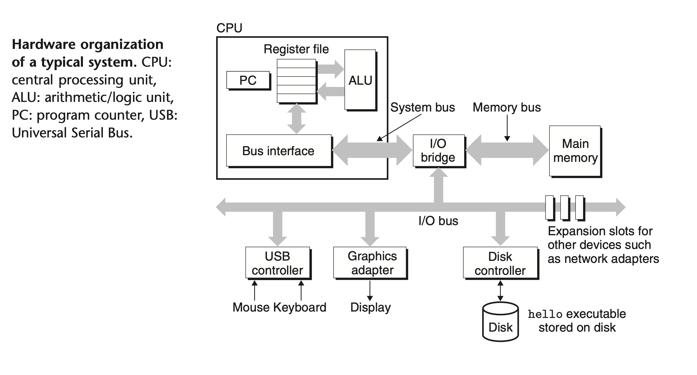

### Buses
Running throughout the system is a collection of electrical conduits called buses that carry bytes of information back and forth between the components. Buses are typically designed to transfer fixed-size chunks of bytes known as words. The number of bytes in a word (the word size) is a fundamental system parameter that varies across systems. Most machines today have word sizes of either 4 bytes (32 bits) or 8 bytes (64 bits). In this book, we do not assume any fixed definition of word size. Instead, we will specify what we mean by a “word” in any context that requires this to be defined.

### I/O Devices
Input/output (I/O) devices are the system’s connection to the external world. Our example system has four I/O devices: a keyboard and mouse for user input, a display for user output, and a disk drive (or simply disk) for long-term storage of data and programs. Initially, the executable hello program resides on the disk.

Each I/O device is connected to the I/O bus by either a controller or an adapter. The distinction between the two is mainly one of packaging. Controllers are chip sets in the device itself or on the system’s main printed circuit board (often called the motherboard). An adapter is a card that plugs into a slot on the motherboard. Regardless, the purpose of each is to transfer information back and forth between the I/O bus and an I/O device.

### Main Memory

The main memory is a temporary storage device that holds both a program and the data it manipulates while the processor is executing the program. Physically, main memory consists of a collection of dynamic random access memory (DRAM) chips. Logically, memory is organized as a linear array of bytes, each with its own unique address (array index) starting at zero. In general, each of the machine instructions that constitute a program can consist of a variable number of bytes. The sizes of data items that correspond to C program variables vary according to type. For example, on an x86-64 machine running Linux, data of type short require 2 bytes, types int and float 4 bytes, and types long and double 8 bytes.

### Processor
The central processing unit (CPU), or simply processor, is the engine that interprets (or executes) instructions stored in main memory. At its core is a word-size storage device (or register) called the program counter (PC). At any point in time, the PC points at (contains the address of) some machine-language instruction in main memory.

From the time that power is applied to the system until the time that the power is shut off, a processor repeatedly executes the instruction pointed at by the program counter and updates the program counter to point to the next instruction. A processor appears to operate according to a very simple instruction execution model, defined by its instruction set architecture. In this model, instructions execute in strict sequence, and executing a single instruction involves performing a series of steps. The processor reads the instruction from memory pointed at by the program counter (PC), interprets the bits in the instruction, performs some simple operation dictated by the instruction, and then updates the PC to point to the next instruction, which may or may not be contiguous in memory to the instruction that was just executed.
There are only a few of these simple operations, and they revolve around main memory, the register file, and the arithmetic/logic unit (ALU). The register file is a small storage device that consists of a collection of word-size registers, each with its own unique name. The ALU computes new data and address values. Here are some examples of the simple operations that the CPU might carry out at the request of an instruction:

- Load: Copy a byte or a word from main memory into a register, overwriting the previous contents of the register.

- Store: Copy a byte or a word from a register to a location in main memory, overwriting the previous contents of that location.
   
- Operate: Copy the contents of two registers to the ALU, perform an arithmetic operation on the two words, and store the result in a register, overwriting the previous contents of that register.
   
- Jump: Extract a word from the instruction itself and copy that word into the program counter (PC), overwriting the previous value of the PC.

We say that a processor appears to be a simple implementation of its instruction set architecture, but in fact modern processors use far more complex mechanisms to speed up program execution. Thus, we can distinguish the processor’s instruction set architecture, describing the effect of each machine-code instruction, from its microarchitecture, describing how the processor is actually implemented. 
