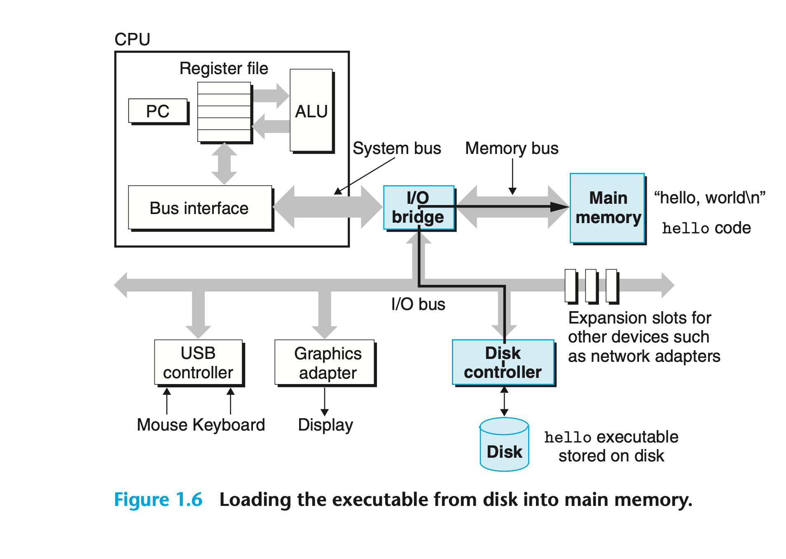

Initially, the shell program is executing its instructions, waiting for us to type a command. As we type the characters ./hello at the keyboard, the shell program reads each one into a register and then stores it in memory.

When we hit the enter key on the keyboard, the shell knows that we have finished typing the command. The shell then loads the executable hello file by executing a sequence of instructions that copies the code and data in the `hello` object file from disk to main memory. The data includes the string of characters `hello, world\n` that will eventually be printed out.

Using a technique known as direct memory access (DMA, discussed in Chap- ter 6), the data in the executable `hello` travel directly from disk to main memory, without passing through the processor. This step is shown in Figure 1.6.