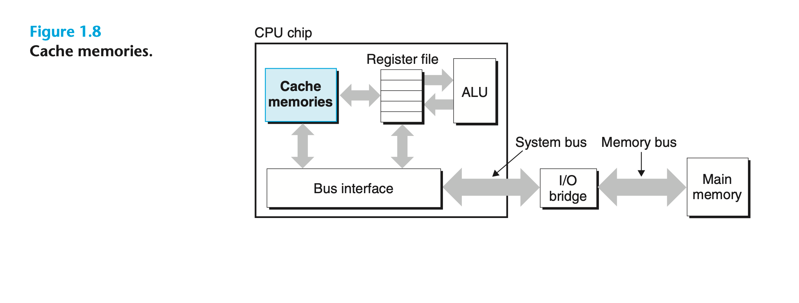

To deal with the processor–memory gap, system designers include smaller, faster storage devices called `cache memories` (or simply caches) that serve as temporary staging areas for information that the processor is likely to need in the near future. Figure 1.8 shows the cache memories in a typical system. An L1 cache on the processor chip holds tens of thousands of bytes and can be accessed nearly as fast as the register file. A larger L2 cache with hundreds of thousands to millions of bytes is connected to the processor by a special bus. It might take 5 times longer for the processor to access the L2 cache than the L1 cache, but this is still 5 to 10 times faster than accessing the main memory. The L1 and L2 caches are implemented with a hardware technology known as `static random access memory` (SRAM).
