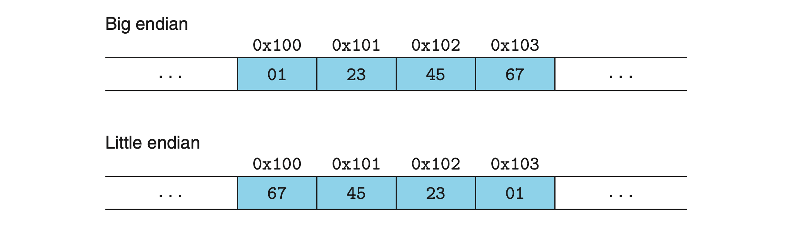

For program objects that span multiple bytes, we must establish two conventions: what the address of the object will be, and how we will order the bytes in memory. In virtually all machines, a multi-byte object is stored as a contiguous sequence of bytes, with the address of the object given by the smallest address of the bytes used. For example, suppose a variable x of type int has address 0x100; that is, the value of the address expression &x is 0x100. Then (assuming data type int has a 32-bit representation) the 4 bytes of x would be stored in memory locations 0x100, 0x101, 0x102, and 0x103.

For ordering the bytes representing an object, there are two common conventions. Consider a w-bit integer having a bit representation $[x_{w−1}, x_{w−2}, . . . , x_1, x_0]$, where $x_{w−1}$ is the most significant bit and x0 is the least. Assuming w is a multiple of 8, these bits can be grouped as bytes, with the most significant byte having bits $[x_{w−1}, x_{w−2}, . . . , x_{w−8}]$, the least significant byte having bits $[x_7, x_6, . . . , x_0]$, and the other bytes having bits from the middle. Some machines choose to store the ob- ject in memory ordered from least significant byte to most, while other machines store them from most to least. The former convention—where the least significant byte comes first—is referred to as `little endian`. The latter convention—where the most significant byte comes first—is referred to as `big endian`.

Suppose the variable x of type int and at address `0x100` has a hexadecimal value of `0x01234567`. The ordering of the bytes within the address range `0x100` through `0x103` depends on the type of machine:

