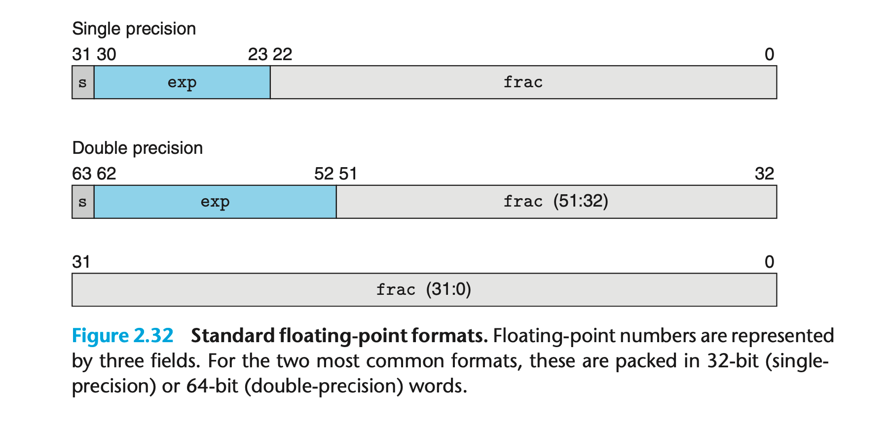

Positional notation such as considered in the previous section would not be efficient for representing very large numbers. For example, the representation of $5 × 2^{100}$ would consist of the bit pattern $101$ followed by 100 zeros.$ $Instead, we would like to represent numbers in a form $x \times 2^y$ by giving the values of $x$ and $y$.

The IEEE floating-point standard represents a number in a form V = (−1)s × M × 2E:

- The `sign` $s$ determines whether the number is negative ($s = 1$) or positive ($s = 0$), where the interpretation of the sign bit for numeric value $0$ is handled as a special case.

- The significand $M$ is a fractional binary number that ranges either between $1$ and $2 − ε$ or between $0$ and $1 − ε$.

-  The `exponent` $E$ weights the value by a (possibly negative) power of $2$.

计算机中的浮点数表示遵循 IEEE 754 标准，这是最常用的浮点数表示方法。该标准定义了浮点数的二进制表示方式，通常使用 32 位（单精度）或 64 位（双精度）来存储。

### 浮点数的组成部分

浮点数由三部分组成：

1. **符号位（Sign bit）**：1 位，表示数值的符号，0 表示正数，1 表示负数。
2. **指数（Exponent）**：用于表示数值的范围。它采用移码（Bias）表示，即存储的值是实际指数加上一个偏移量。
3. **尾数（Mantissa or Fraction）**：表示数值的精度。尾数通常采用规格化形式存储，即假定第一个有效数字是1，不存储这个1，只存储小数部分。

### 单精度浮点数（32 位）

- 1 位：符号位
- 8 位：指数部分
- 23 位：尾数部分

结构如下：

$$(-1)^S × 2^(E - 127) × 1.M$$

其中：

- S 是符号位
- E 是指数位的值，范围为 0 到 255（实际指数是 E - 127）
- M 是尾数的二进制小数部分

### 双精度浮点数（64 位）

- 1 位：符号位
- 11 位：指数部分
- 52 位：尾数部分

结构如下：

$$(-1)^S × 2^(E - 1023) × 1.M$$

其中：

- S 是符号位
- E 是指数位的值，范围为 0 到 2047（实际指数是 E - 1023）
- M 是尾数的二进制小数部分

### 特殊值

- **零**：当指数和尾数全为 0 时，表示正零或负零。
- **无穷大**：当指数全为 1，尾数全为 0 时，表示正无穷大或负无穷大。
- **NaN（Not a Number）**：当指数全为 1，尾数不全为 0 时，表示非数值，通常用于表示未定义的结果。

### 示例

例如，对于 32 位的单精度浮点数：

- `0 10000001 01100000000000000000000` 表示的值是 `+5.5`。
    - 符号位 `0` 表示正数。
    - 指数部分 `10000001` 转换为十进制是 129，实际指数是 `129 - 127 = 2`。
    - 尾数部分 `01100000000000000000000` 表示小数 `1.011`（即 1.375）。

因此，计算结果为 `1.375 × 2^2 = 5.5`。