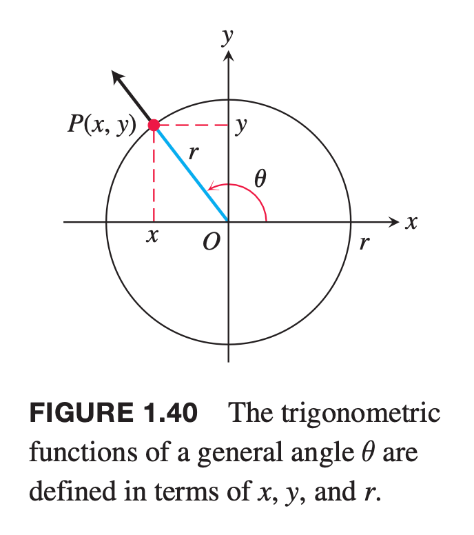

$$y = f(x)$$
 y equals f of x.
 
The symbol $f$ represents the function, the letter $x$ is the independent variable representing the input value to $f$, and $y$ is the dependent variable or output value of $f$ at $x$.

A function f from a set $D$ to a set $Y$ is a rule that assigns a single value $f (x)$ in $Y$ to each $x$ in $D$.
The set $D$ of all possible input values is called the **domain** of the function. The set of all output values $f(x)$ as $x$ varies throughout $D$ is called the **range** of the function.

## Increasing and Decreasing Functions

Let $f$ be a function defined on an interval $I$ and let $x_1$ and $x_2$ be two distinct points in $I$.

1. If $f(x) > f(x)$ whenever $x_1 < x_2$ , then $f$ is said to be **increasing** on $I$. 

2. If $f(x) < f(x)$ whenever $x_1 < x_2$ , then $f$ is said to be **decreasing** on $I$.

## Even Functions and Odd Functions: Symmetry

A function $y = f(x)$ is an  
**even function** of $x$ if $f(−x) = f(x)$,
**odd function** of $x$ if $f(−x) = −f(x)$, for every $x$ in the function’s domain.

The graph of an even function is **symmetric about the y-axis**.
The graph of an odd function is **symmetric about the origin**.

## The Six Basic Trigonometric Functions

**sine**: $sin\theta = {y\over r}$           **cosecant**: $csc\theta = {r\over y}$
**cosine**:  $cos\theta = {x\over r}$     **secant**: $sec\theta = {r\over x}$
**tangent**: $tan\theta = {y\over x}$   cotangent:  $cot\theta = {x\over y}$

$tan\theta = {sin\theta \over cos\theta}$    $cot\theta = {1 \over tan\theta}$
$sec\theta = {1 \over cos\theta}$    $csc\theta = {1 \over sin\theta}$

$$sin^2\theta + cos^2\theta = 1$$
$$tan^2\theta + 1 = sec^2\theta$$
$$cot^2\theta + 1 = csc^2\theta$$

$$cos(A+B)=cosA\cdot cosB-sinA\cdot sinB$$
$$sin(A+B)=sinA \cdot cosB + cosA \cdot sinB$$
**Double-Angle Formulas**: $cos2θ = cos^2θ−sin^2θ$, $sin2θ = 2sinθ \cdot cosθ$

**Half-Angle Formulas**: $cos^2\theta={1+cos2\theta \over 2}$, $sin^2\theta={1-cos2\theta \over 2}$
**The Law of Cosines**: $c2 =a2+b2−2ab \cdot cosθ$.

**Change-of-Base Formula**

Every logarithmic function is a constant multiple of the natural logarithm.
$$
log_a x = ln\ x (a > 0, a ≠ 1)
$$